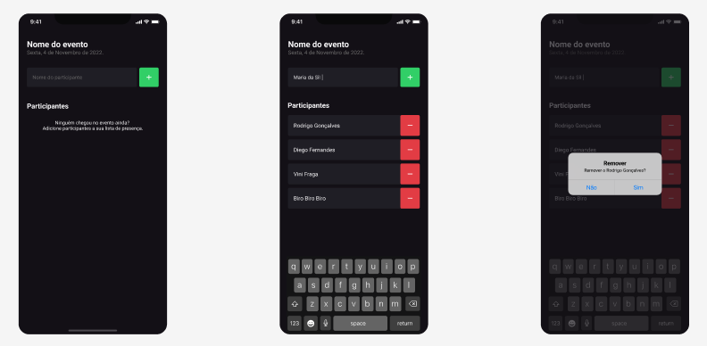

#  <h1> Participant </h1>


Para iniciar o **Projeto** inicie o seu emulador e utilize os comandos:

```bash
npm install
expo start
digite a tecla A ou abra no seu emulador 
```
## É necessario que tenha algum emulador para rodar o projeto
 O Projeto foi desenvolvido com muita dedicação e ele ficou assim:
 
</img>

<h2> Objetivo </h2>

- [x] Cadastrar um participantre
- [x] Remover um participante
- [x] Não é possivel cadastrar participante com o mesmo nome
- [x] Mostrar a data atual

## 🛠 Tecnologias

As seguintes ferramentas foram usadas na construção do projeto:

- [React Native](https://reactnative.dev/)
- [Android Studio](https://developer.android.com/studio?hl=pt&gclid=CjwKCAiAnZCdBhBmEiwA8nDQxan1gflu6wxpeN3KqCukJAUNPPCILIeiBS5s9pc3uHWk8mcJN3JU-BoCj4AQAvD_BwE&gclsrc=aw.ds)

